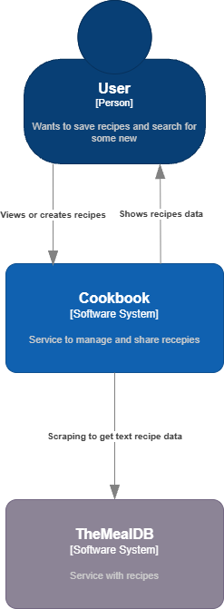
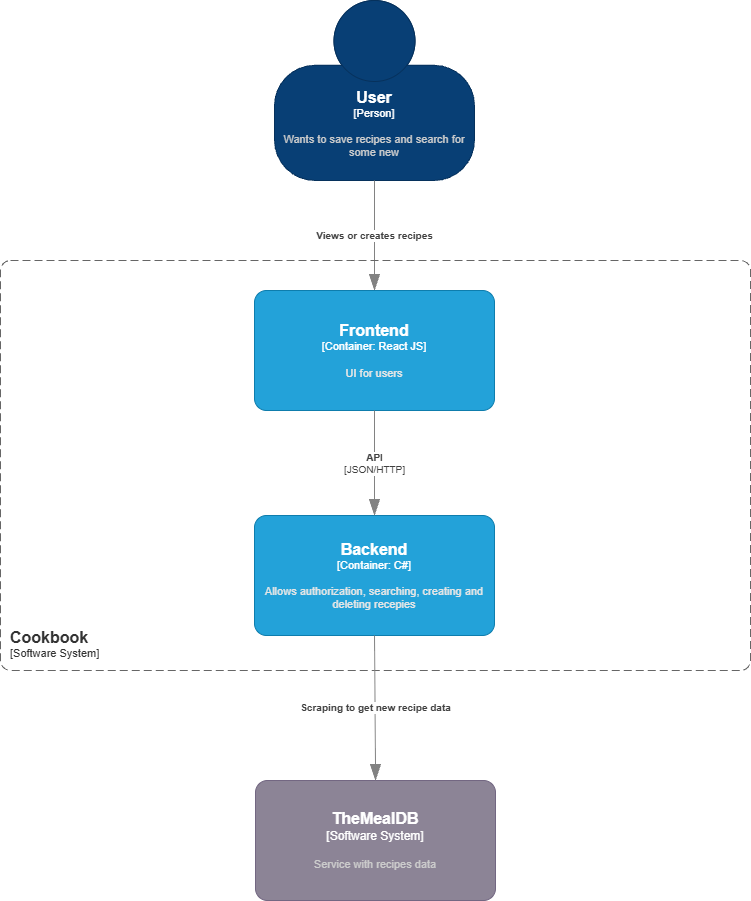
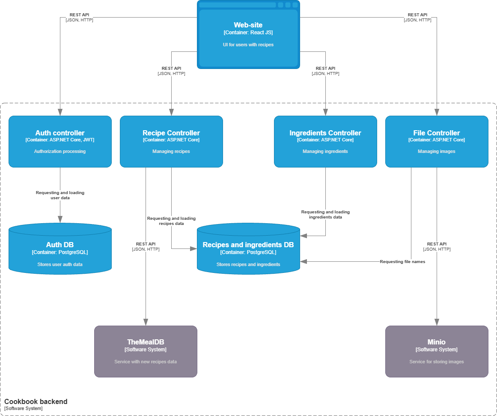
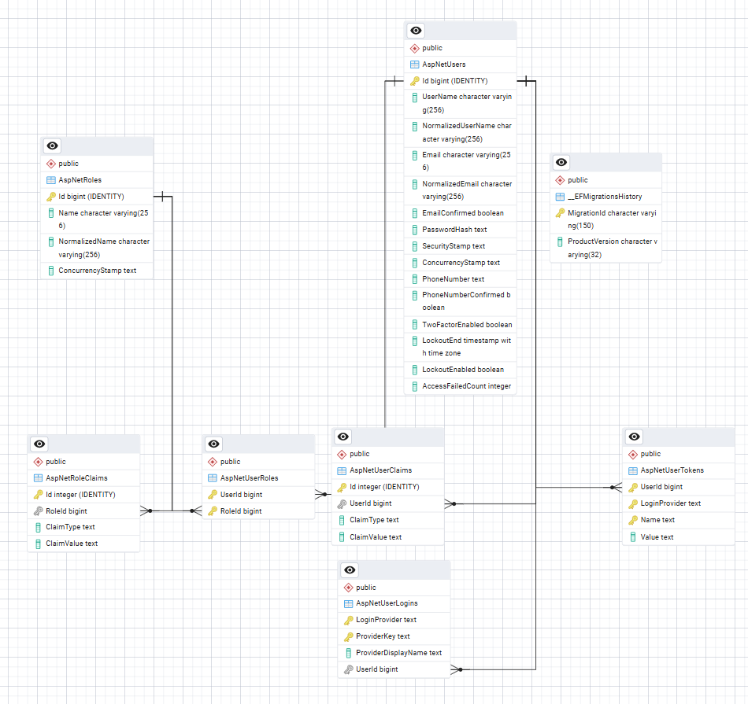
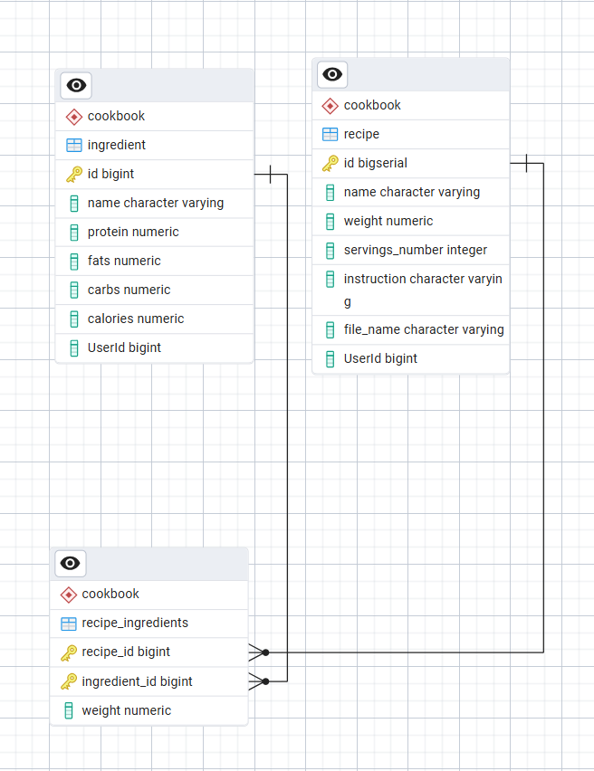

# Cookbook
Сервис организации рецептов

## Состав команды

---

Редько Арина, 5130904/30105
Хорошкин Максим, 5130904/30105
Гредасов Марк, 5130904/30105

## Проблема

---

Людям, увлекающимся готовкой, сложно систематизировать и находить интересные рецепты: свои идеи теряются в заметках, а чужие — в лентах соцсетей, на разных сайтах. Не хватает централизованного места, где можно не только сохранять свои рецепты, но и обращаться к понравившимся находкам. Кроме того, при усталости от однообразного рациона или нехватке времени сложно быстро придумать новое блюдо из доступных продуктов.

## Требования

---

1. Как человек, увлекающийся кулинарией, я хочу сохранять понравившиеся рецепты в единое хранилище, чтобы они не были разбросаны по заметкам и соцсетям.

2. Как человек, которому надоел однообразный рацион питания, я хочу найти новый рецепт на основе имеющихся ингредиентов или сгенерировать случайный рецепт, чтобы получить идеи для готовки и сэкономить время на поисках.

3. Как автор своего рецепта, я хочу опубликовать его на платформе, чтобы поделиться опытом и кулинарными успехами.

## Разработка архитектуры и детальное проектирование

---

### Число пользователей сервиса

Высокоуровневая оценка числа пользователей сервиса - 10.000 человек в сутки. Это число включает как активных авторов, так и пользователей, которые преимущественно просматривают и сохраняют рецепты.

### Период хранения информации

Учитывая, что рецепты, оценки и кулинарные коллекции представляют долгосрочную ценность для пользователей, мы закладываем срок хранения основных пользовательских данных (профили, рецепты, ингредиенты) — не менее 7 лет.

### Характер нагрузки на сервис

* <b> Соотношение R/W нагрузки </b>
Оценочное соотношение R/W = 90% / 10%. Чтение сильно доминирует, так как предполагается, что большая часть пользователей использует сервис для поиска уже загруженных рецептов.

* <b> Объемы трафика </b>
Допустим, в среднем пользователь совершает 15 действий/день (открытие, создание рецепта). Общее число запросов: `15 * 10.000 = 150.000 запросов/день`. Рассчитаем объем сетевого трафика: <b>Текстовые данные:</b> средний ответ API - 15 КБ, страница с ресурсами - 500 КБ. В день: `150.000 * (15 + 500) = 75 ГБ/день`. <b> Изображения:</b> средний вес фото рецепта - 1 МБ. `150.000 * 1 = 146 ГБ/день`. <b>Итого:</b> `~225 ГБ/день`.

* <b>Объемы дисковой системы</b>
Рассчитываем, что с числом пользователей сервиса в 10.000 человек/день за 7 лет сервис будет насчитывать порядка 500.000 пользователей. Около 10% пользователей создают рецепты, по 10 рецептов в год. За 7 лет: `500.000 * 0.1 * 10 * 7 = 3.500.000 рецептов`. К каждому рецепту может прилагаться фотография. Будем считать, что изображение имеет 90% рецептов, а средний вес фото - 1 МБ. Тогда: `0.9 * 3.500.000 * 1 = 3 ТБ`.

### Диаграммы C4 Model

* <b>Контекст</b>


* <b>Контейнеры</b>


* <b>Компоненты</b>


### Контракты API

Информация о методах API доступна [по ссылке](./assets/APIContract.md).

### Базы данных

##### Схемы баз данных

* Auth DB



* Recipes and Ingredients DB



База данных спроектирована с учётом выполнения нефункциональных требований по производительности, масштабируемости и надёжности.

* Нормализованная структура обеспечивает эффективное хранение и быстрый доступ к данным за счёт разделения информации по специализированным таблицам. Это исключает дублирование данных и минимизирует объём операций ввода-вывода.

* Индексация включает первичные ключи для всех сущностей. Это гарантирует удовлетворительное время отклика и отсутствие дублирования.

* Связи между таблицами реализованы через внешние ключи, что обеспечивает целостность данных. Каскадное удаление настроено для автоматической очистки зависимых записей, что исключает появление ненужных данных.

Такая архитектура позволяет системе стабильно работать с прогнозируемой нагрузкой в 10.000 пользователей в день и масштабироваться при дальнейшем росте.

### Схема масштабирования сервиса

При увеличении количества пользователей в 10 раз могут быть внедрены следующие технологии:

1. <b>Балансировщик нагрузки.</b> Распределение трафика между несколькими серверами приложения позволит оптимально использовать доступные вычислительные ресурсы, не допускать перегрузки, обеспечить отказоустойчивость и масштабируемость.

2. <b>Кэш.</b> Кэширование часто запрашиваемых данных позволит уменьшить нагрузку на БД и ускорить получение ответа API.

3. <b>Реплики для чтения БД.</b> Так как большую часть запросов в базу данных составляет чтение, при увеличении количества пользователей могут потребоваться реплики для чтения БД, чтобы снизить нагрузку на основную базу данных.

## Кодирование и отладка

---

### Стек используемых технологий:

##### Frontend
1. React JS - JavaScript-библиотека для разработки пользовательских интерфейсов.
2. Vite - инструмент для эффективной сборки проектов на React.

##### Backend
`Coming soon...`


## Тестирование

---

Для запуска тестов необходимо вызвать `dotnet test src/Cookbook/CookbookTests/CookbookTests.csproj`. 

### Unit-тесты

Реализованные тесты проверяют корректную работу backend - базы данных, сервиса minio, утилит.

### Интеграционные тесты

Реализованные тесты проверяют корректность работы контроллеров.


## Сборка

---

Для сборки серверной части проекта необходимо выполнить:

```
Coming soon...
```
